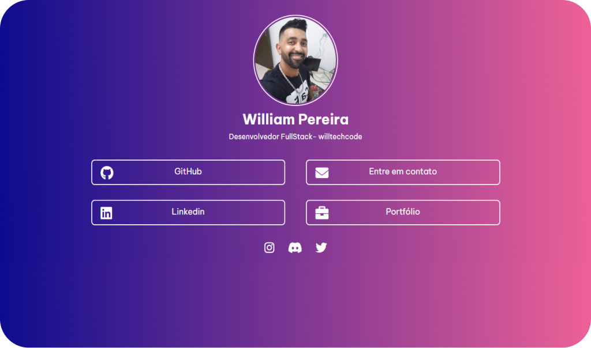

  <p align="center">
   
  </p>

  <p align="center">
  
  
  
</p>

<p align="center">
   
  </p>

# :clipboard: Sobre o projeto

Este é o meu Portfólio, onde você poderá ver um pouco mais sobre mim e como entrei no mundo do desenvolvimento, e ainda alguns dos meus principais projetos. Tudo isso em um só lugar.

Abaixo podemos ver o resultado final do projeto. Espero que gostem!

<br>
<p align="center">
   
  </p>

# 🔗 Acesse o site com o link abaixo.

- [William Pereira | Portfólio]()

## :computer: Tecnologias utilizadas

Este projeto foi desenvolvido com as seguintes tecnologias:

- [React.js](https://pt-br.reactjs.org/)
- [Node.js](https://nodejs.org/en/)
- [JavaScript](https://www.javascript.com/)
- [Bootstrap](https://getbootstrap.com/)
- [Styled-Components](https://styled-components.com/)
- [HTML](https://developer.mozilla.org/pt-BR/docs/Web/HTML)
- [CSS](https://developer.mozilla.org/pt-BR/docs/Web/CSS)

## 🌐 Para iniciarlizar o projeto utilize o comando abaixo:

```bash

#Clonando o repositório do Github:
$ git clone https://github.com/degabrielofi/MyPortfolio

#Acessar pasta Web:
$ cd Web

#Instalar alguns packages:
$ npm i infinite-react-carousel react-bootstrap react-dom react-elastic-carousel react-icons react-router-dom styled-components sweetalert2 sweetalert2-react-content

#Inicializar pasta Web:
$ npm run start

```

## 🗃️ Para iniciarlizar a parte do Back-End utilize o comando abaixo:

```bash

#Clonando o repositório do Github:
$ git clone https://github.com/degabrielofi/MyPortfolio

#Acessar pasta Web:
$ cd Server

#Instalar alguns packages:
$ npm i cors express nodemailer

#Inicializar pasta Server:
$ npm run start

```

##

<p align="center">
  
  </p>
